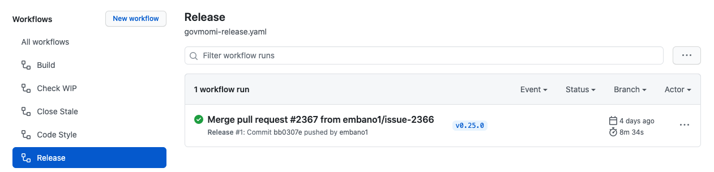

# How to create a new `govmomi` Release on Github

On every new tag matching `v*` pushed to the repository a Github Action Release
Workflow is executed. 

The Github Actions release [workflow](.github/workflows/govmomi-release.yaml)
uses [`goreleaser`](http://goreleaser.com/) ([configuration
file](.goreleaser.yml)) and automatically creates/pushes:

- Release artifacts for `govc` and `vcsim` to the
  [release](https://github.com/vmware/govmomi/releases) page, including
  `LICENSE.txt`, `README` and `CHANGELOG`
- Docker images for `vmware/govc` and `vmware/vcsim` to Docker Hub
- Source code

⚠️ **Note:** These steps can only be performed by maintainers or administrators
of this project.

## Verify `master` branch is up to date with the remote

```console
$ git checkout master
$ git fetch -avp
$ git diff master origin/master

# if your local and remote branches diverge run
$ git pull origin/master
```

⚠️ **Note:** These steps assume `origin` to point to the remote
`https://github.com/vmware/govmomi`, respectively
`git@github.com:vmware/govmomi`.


## Set `RELEASE_VERSION` variable

This variable is used and referenced in the subsequent commands. Set it to the
**upcoming** release version, adhering to the [semantic
versioning](https://semver.org/) scheme:

```console
$ export RELEASE_VERSION=v0.25.0
```

## Create the Git Tag

```console
$ git tag -a ${RELEASE_VERSION} -m "Release ${RELEASE_VERSION}"
```

## Push the new Tag

```console
# Will trigger Github Actions Release Workflow
$ git push origin refs/tags/${RELEASE_VERSION}
```

## Verify Github Action Release Workflow

After pushing a new release tag, the status of the
workflow can be inspected
[here](https://github.com/vmware/govmomi/actions/workflows/govmomi-release.yaml).



## Update the CHANGELOG

After a successful release, update the [CHANGELOG](CHANGELOG.md). The
`CHANGELOG.md` is generated with `git-chglog` and requires the release tag (see
[above](#create-the-git-tag)) to be created before updating the `CHANGELOG.md`
file.

To avoid inconsistencies with the
[release](.github/workflows/govmomi-release.yaml) workflow, please use the same
Docker image to create the `CHANGELOG.md`.

```console
$ IMAGE=quay.io/git-chglog/git-chglog
$ IMAGE_SHA=998e89dab8dd8284cfff5f8cfb9e9af41fe3fcd4671f2e86a180e453c20959e3
$ docker run --rm -v $PWD:/workdir ${IMAGE}@sha256:${IMAGE_SHA} -o CHANGELOG.md v0.1.0..${RELEASE_VERSION}
⌚  Generating changelog ...
✨  Generate of "CHANGELOG.md" is completed! (8.4079146s)
```

Verify the modified file and create a PR following the usual
[CONTRIBUTING](CONTRIBUTING.md) guidelines to commit the changes in
`CHANGELOG.md`.

⚠️ **Note:** The **commit message title** for the `CHANGELOG` PR should follow this
convention: 

> `"Update CHANGELOG for ${RELEASE_VERSION}"`. 
 
These commit messages are then excluded from the `CHANGELOG.md`.
