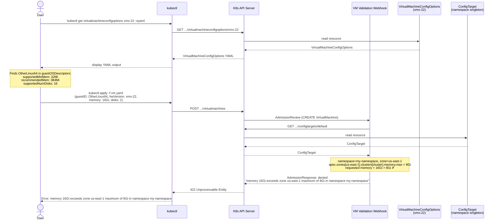

# Environment Browser

The vSphere [`EnvironmentBrowser`](https://developer.broadcom.com/xapis/vsphere-web-services-api/latest/vim.EnvironmentBrowser.html) managed object provides access to the execution environment of a `ComputeResource` or `VirtualMachine`. It exposes three kinds of information that together describe what hardware can be provisioned and what physical resources are available:

| vSphere API method | Kubernetes resource | Scope |
|---|---|---|
| `QueryConfigOption` / `QueryConfigOptionEx` | `VirtualMachineConfigOptions` | Cluster |
| `QueryConfigTarget` | `ClusterConfigTarget` | Cluster |
| `QueryConfigTarget` (scoped to a namespace) | `ConfigTarget` | Namespace |

## VirtualMachineConfigOptions

`VirtualMachineConfigOptions` is a **cluster-scoped** resource with one object per supported hardware version (e.g., `vmx-22`). It maps to the vSphere `VirtualMachineConfigOption` returned by `QueryConfigOption` / `QueryConfigOptionEx`.

The resource's status contains:

- **`GuestOSDescriptors`** — a list of every supported guest OS identifier (`OtherLinux64`, `windows2022srv64Guest`, etc.), each with per-OS constraints such as minimum memory (`SupportedMinMem`), recommended memory (`RecommendedMem`), maximum memory (`SupportedMaxMem`), maximum CPU count (`SupportedMaxCPUs`), maximum disk count (`SupportedNumDisks`), supported and recommended firmware types, supported and recommended disk and NIC controllers, TPM and Secure Boot support, hot-add/remove capabilities, and more.
- **`HardwareOptions`** — hardware-version-level constraints on memory range, CPU counts and SMT threads, NUMA nodes, and the full set of virtual device controller options (IDE, SCSI, USB, NVMe, etc.).
- **`Capabilities`** — flags indicating which VM-level features are available for this hardware version, such as snapshot support, change-block tracking, Secure Boot, nested HV, AMD SEV/SEV-SNP, Intel TDX, vTPM 2.0, and more.
- **`DefaultDevices`** — the virtual devices automatically created by vSphere for this hardware version; clients should not specify these explicitly.
- **`PropertyRelations`** — relationships between VM config spec properties (e.g., a particular guest ID implying a required firmware type).

## ClusterConfigTarget

`ClusterConfigTarget` is a **cluster-scoped** resource with one object per vSphere cluster visible to Supervisor. It maps to the vSphere `ConfigTarget` returned by `QueryConfigTarget` for a specific host or cluster. Its status reflects the physical capabilities of the cluster:

- CPU counts, physical cores, NUMA node count, SMT thread limits, and the maximum CPU count per VM.
- Memory limits (`SupportedMaxMem`, `MaxMemOptimalPerf`).
- Available passthrough and specialty devices: PCI passthrough, SR-IOV NICs, vGPU devices and profiles, shared GPU passthrough types, Intel SGX target info, precision clock resources, vendor device groups, DVX device classes, IDE and SCSI raw disk targets, vFlash modules, USB devices, CD-ROM and floppy devices, and serial/parallel ports.
- Hardware security flags: `SEVSupported`, `SEVSNPSupported`, `TDXSupported`, and `SmcPresent`.

## ConfigTarget

`ConfigTarget` is a **namespace-scoped** singleton — one object per namespace. Tenant administrators use its spec to constrain which physical resources are visible and what resource limits apply to VMs created in that namespace.

The spec is organized by zone and then by vSphere cluster within each zone. Per-cluster constraints include:

- **`Memory`** (`ResourceQuantityRange`) — the minimum and maximum memory allowed for a VM in this namespace/zone/cluster, plus a default.
- **`RecommendedMemory`** — the recommended memory size.
- **`NumCPUs`**, **`NumCPUCores`**, **`NumNUMANodes`**, **`NumSimultaneousThreads`** (`IntRange`) — CPU and topology constraints.
- **`AvailablePersistentMemoryReservation`** — maximum persistent memory (NVDIMM) reservation.
- The same device categories as `ClusterConfigTarget` (passthrough, vGPU, SR-IOV, etc.), allowing admins to expose only a subset of the cluster's physical devices to a given namespace.

## Workflows

### Creating a VM with configuration validation

The following scenario walks through how a user leverages the environment browser APIs when deploying a new virtual machine.

1. The user wants to deploy a VM. They pick a Linux image, but are unsure which guest ID to use. Because the image is 64-bit, they elect to go with `OtherLinux64`.

2. The user decides to target hardware version `vmx-22`.

3. Before creating the VM, the user queries the configuration options for that hardware version:

   ```shell
   kubectl get virtualmachineconfigoptions vmx-22 -oyaml
   ```

4. In the output, the user locates the `OtherLinux64` entry inside `status.guestOSDescriptors`. They learn that the minimum memory is **32 Mi**, the recommended memory is **384 Mi**, and the maximum number of supported disks is **16**.

5. The user decides to create the VM with **16 GiB** of memory and **2** disks.

6. The Kubernetes API server receives the `VirtualMachine` create request and routes it to the VM resource's validation webhook.

7. The webhook checks the namespace for a `ConfigTarget` object (a namespace singleton). It finds one, and reads the `Memory` field (`ResourceQuantityRange`) for the relevant zone and cluster. The tenant administrator has set the maximum memory per VM to **8 Gi**.

8. Since the requested memory (16 Gi) exceeds the namespace maximum (8 Gi), the webhook rejects the request with an error, which the API server returns to `kubectl`.


